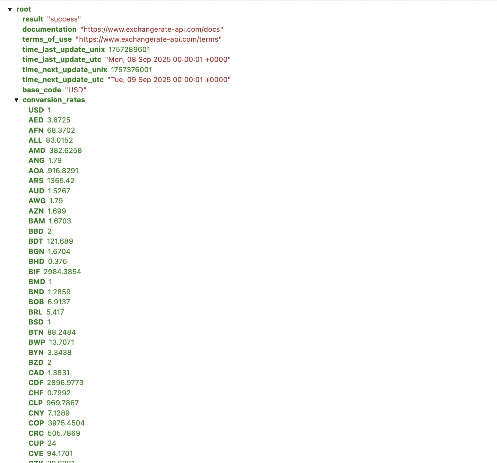
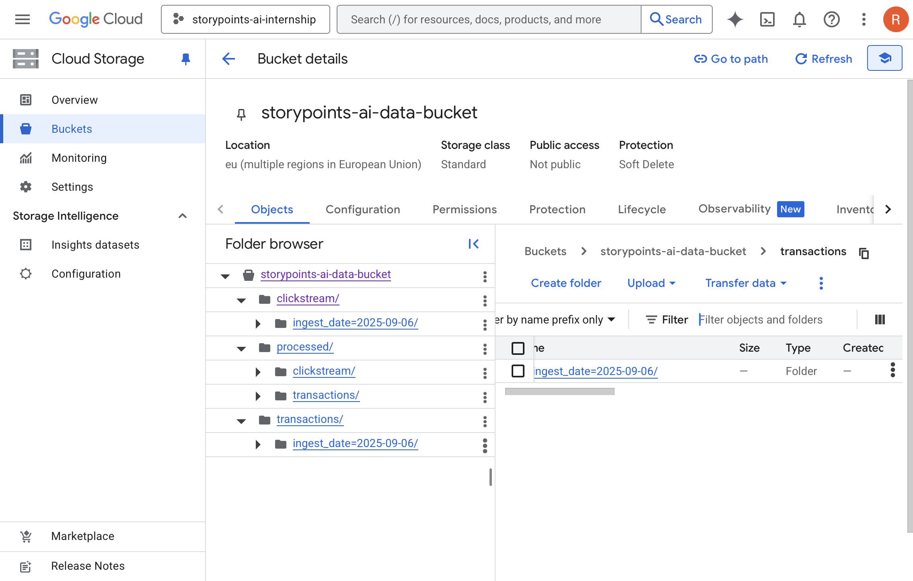
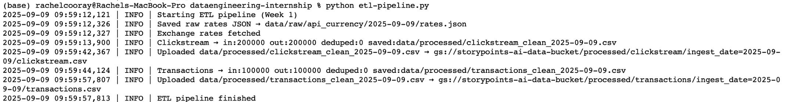
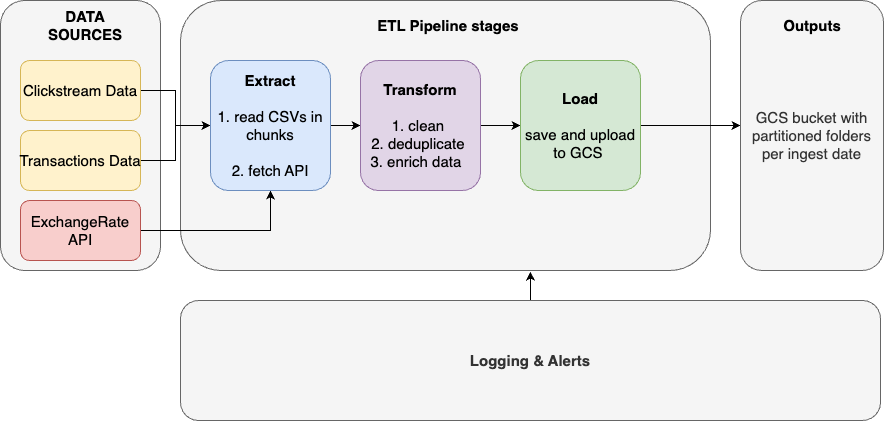

# StoryPoints AI – Data Engineering Internship (Week 1)

## Overview
This project implements an ETL pipeline that extracts clickstream and transaction data, applies transformations, and stores cleaned outputs in Google Cloud Storage (GCS). It also fetches live currency exchange rates from the ExchangeRate API and enriches transaction data.

---

## Datasets
### clickstream.csv (200,000 rows)
- **Columns (after standardization)**: `user_id`, `session_id`, `page_url`, `click_time`  
- **Notes**:  
  - No null values in key identifiers  
  - `click_time` parsed to UTC  
  - No duplicates after cleaning  

### transactions.csv (100,000 rows)
- **Columns (after standardization)**: `transaction_id`, `user_id`, `amount`, `currency`, `txn_time`, `amount_in_usd`  
- **Notes**:  
  - Timestamps converted to UTC  
  - `amount_in_usd` derived using API conversion rates  
  - No duplicate rows after cleaning  

### ExchangeRate API
- Live rates fetched from `https://v6.exchangerate-api.com/v6/{API_KEY}/latest/USD`  
- Raw JSON stored daily at: `data/raw/api_currency/YYYY-MM-DD/rates.json`

* 

---

## Tasks Completed
- **Task 1**: Explored data, nulls, and duplicates. Documented above.  
- **Task 2**: Extracted CSVs in 50,000 chunks & fetched currency rates via API.  
- **Task 3**: Standardized columns, converted timestamps to UTC, deduplicated, enriched transactions with `amount_in_usd`.  
- **Task 4**: Loaded cleaned outputs into GCS, partitioned by `ingest_date=YYYY-MM-DD/`.  
- **Task 5**: Implemented logging for record counts, API errors, and missing inputs.  
- **Task 6**: Designed architecture diagram.  

---

## Output Structure
This shows how processed outputs are organized in **Google Cloud Storage (GCS)**:

* 

- Ensures each dataset is stored in a structured, partitioned way by ingestion date.  
- Makes it easier for analytics and downstream pipelines like BigQuery to query data by time period.    

---

## Logging & Alerts

The pipeline has structured logging and warning messages.  

**Used for**:  
- Records number of rows read, processed, and deduplicated.  
- Captures API request errors.  
- Prints **warnings** if:  
  - Input CSV files are missing  
  - Currency codes are not found in the exchange rates  
- Ensures visibility into ETL health without manual debugging.  

* 

---

## Architecture Diagram

---

